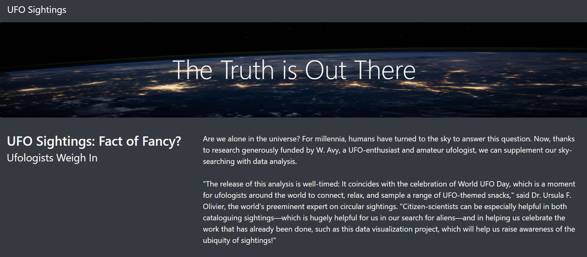
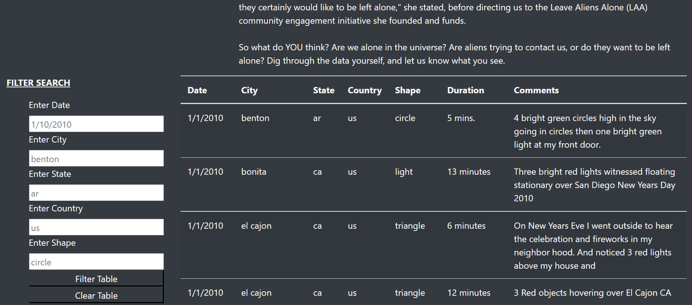

# UFOs

## Table of Contents

- [Overview of Project](#overview-of-project)
- [Results](#results)
- [Summary](#summary)

## Overview of Project
Dana's page and dynamic table are functioning as expected, yet she'd prefer to give a more inside and out investigation of UFO sightings by permitting clients to channel for numerous rules simultaneously. Notwithstanding the date, you'll add table channels for the city, state, nation, and shape.
## Results

## Summary
- The summary addresses one drawback of this webpage
> One drawback of this plan is the trouble for the client to know what boundary to use for the sifting. For instance, to pick a city, the client would need to go through the table a discover the city wanted for the investigation. 

- The summary addresses two additional recommendations for further development
> An approach to address this is available drop-down records incorporating all channel esteems instead of the information fields. 

> Each rundown would have to refresh after a boundary is chosen in any channel.
Counting a button to clear the channels is additionally required. The button would be situated underneath the last channel.
